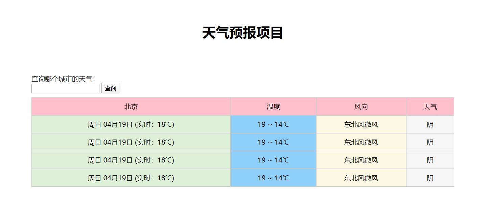

# 项目：天气预报
<iframe width="100%" height="415" src="https://www.youtube.com/embed/YBr1lPHlPmA" frameborder="0" allow="accelerometer; autoplay; encrypted-media; gyroscope; picture-in-picture" allowfullscreen></iframe>
<iframe width="100%" height="415" src="//player.bilibili.com/player.html?aid=667829422&bvid=BV1Ra4y1x7y3&cid=181558500&page=1" scrolling="no" border="0" frameborder="no" framespacing="0" allowfullscreen="true"> </iframe>


天气接口地址：`https://api.map.baidu.com/telematics/v3/weather`<br />
请求方式：`GET`、`POST`<br />
参数1：`ak`  值：`zVo5SStav7IUiVON0kuCogecm87lonOj`<br />
参数2：`output`  值：`json`<br />
参数3：`location`  值：城市名字

天气视图页面：
```html showLineNumbers'
<!DOCTYPE html>
<html lang="en">

<head>
  <meta charset="UTF-8">
  <meta name="viewport" content="width=device-width, initial-scale=1.0">
  <title>天气预报</title>
  <style>
    h1 {
      margin-top: 60px;
      text-align: center;
    }

    .box {
      width: 1000px;
      margin: 80px auto;
    }

    .inp {
      margin-bottom: 10px;
    }

    table {
      width: 100%;
      text-align: center;
      background-color: #F5F5F5;
    }

    td {
      border: 1px solid #ccc;
    }

    tr:nth-child(1) {
      background-color: pink;
    }

    .date {
      background-color: #DFF0D8;
    }

    .temperature {
      background-color: #8ED0F9;
    }

    .wind {
      background-color: #FCF8E3;
    }
  </style>
</head>

<body>
  <h1>天气预报项目</h1>

  <div class="box">
    <div class="inp">
      <span>查询哪个城市的天气：</span>
      <form action="http://127.0.0.1:7001/weather" method="POST">
        <input type="text" name="location" required>
        <button type="submit">查询</button>
      </form>
    </div>
    <table cellspacing="0" cellpadding="10">
      <tr>
        <td>北京</td>
        <td>温度</td>
        <td>风向</td>
        <td>天气</td>
      </tr>
      <tr>
        <td class="date">周日 04月19日 (实时：18℃)</td>
        <td class="temperature">19 ~ 14℃</td>
        <td class="wind">东北风微风</td>
        <td>阴</td>
      </tr>
      <tr>
        <td class="date">周日 04月19日 (实时：18℃)</td>
        <td class="temperature">19 ~ 14℃</td>
        <td class="wind">东北风微风</td>
        <td>阴</td>
      </tr>
      <tr>
        <td class="date">周日 04月19日 (实时：18℃)</td>
        <td class="temperature">19 ~ 14℃</td>
        <td class="wind">东北风微风</td>
        <td>阴</td>
      </tr>
      <tr>
        <td class="date">周日 04月19日 (实时：18℃)</td>
        <td class="temperature">19 ~ 14℃</td>
        <td class="wind">东北风微风</td>
        <td>阴</td>
      </tr>
    </table>
  </div>
</body>

</html>
```

<a href="https://www.vultr.com/?ref=8371895-6G"></a>
